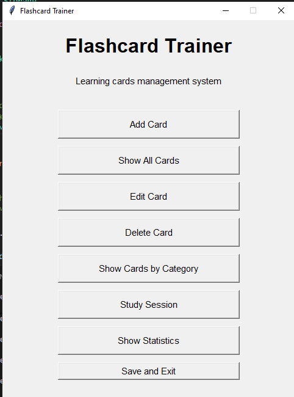
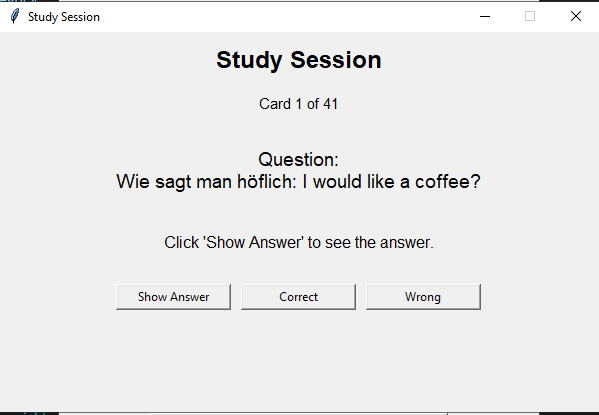

# Lernkarten-Trainer


## 1. Projektbeschreibung

Dieses Projekt ist ein einfacher **Lernkarten-Trainer in Python**.

Mit dem Programm können Lernkarten erstellt, gespeichert, geladen, bearbeitet und gelöscht werden. Außerdem kann eine Lernsession durchgeführt werden. Nach jeder Karte wird gespeichert, ob die Antwort richtig oder falsch war.

Das Programm besitzt eine einfache grafische Oberfläche mit Buttons. Dadurch kann der Benutzer das Programm mit der Maus bedienen, ohne Zahlen im Terminal eingeben zu müssen.

---

## 2. Vorschau der Oberfläche

### Hauptmenü

Das Hauptmenü zeigt alle wichtigen Funktionen des Programms. Der Benutzer kann jede Funktion direkt mit einem Button starten.



---

### Karte hinzufügen

Über dieses Fenster kann eine neue Lernkarte mit Frage, Antwort und Kategorie erstellt werden.


---

### Alle Karten anzeigen

Alle gespeicherten Lernkarten werden übersichtlich in einer Tabelle angezeigt.


---

### Karten nach Kategorie anzeigen

Der Benutzer kann eine Kategorie eingeben und nur die passenden Lernkarten anzeigen lassen.


---

### Lernsession

In der Lernsession wird zuerst die Frage angezeigt. Danach kann der Benutzer die Antwort anzeigen lassen und entscheiden, ob seine Antwort richtig oder falsch war.



---

### Statistiken

Das Statistikfenster zeigt wichtige Informationen über den Lernfortschritt, zum Beispiel die Anzahl der Karten, Erfolgsquoten und schwierige Karten.


---

## 3. Ziel des Projekts

Ziel des Projekts ist die Entwicklung eines kleinen Python-Programms, das Lernkarten verwaltet und den Lernfortschritt speichert.

Das Projekt wurde so aufgebaut, dass wichtige Funktionen getrennt in Klassen organisiert sind. Dadurch ist der Code übersichtlich und einfacher zu testen.

---

## 4. Funktionen des Programms

Das Programm bietet folgende Funktionen:

- Neue Lernkarten hinzufügen
- Alle Lernkarten anzeigen
- Lernkarten bearbeiten
- Lernkarten löschen
- Lernkarten nach Kategorie anzeigen
- Lernsession durchführen
- Richtige und falsche Antworten speichern
- Wiederholungslogik verwenden
- Statistiken anzeigen
- Daten dauerhaft in einer JSON-Datei speichern

---

## 5. Aufbau einer Lernkarte

Eine Lernkarte besteht aus folgenden Informationen:

- Frage
- Antwort
- Kategorie
- Anzahl richtiger Antworten
- Anzahl falscher Antworten

Beispiel:

```json
{
    "question": "Was ist Python?",
    "answer": "Eine Programmiersprache",
    "category": "Programmierung",
    "correct_answers": 2,
    "wrong_answers": 1
}
```

---

## 6. Projektstruktur

Die Projektdateien sind ungefähr so aufgebaut:

```text
project/
│
├── main.py
├── flashcard.py
├── manager.py
├── storage.py
├── cardstatistics.py
├── repetition.py
├── requirements.txt
├── README.md
│
├── data/
│   └── cards.json
│
├── picture/
│   ├── add card.PNG
│   ├── all card.PNG
│   ├── card by category.PNG
│   ├── menu.PNG
│   ├── static.PNG
│   └── study.PNG
│
└── tests/
    └── test_*.py
```

---

## 7. Beschreibung der wichtigsten Dateien

### `flashcard.py`

Diese Datei enthält die Klasse `Flashcard`.

Sie beschreibt eine einzelne Lernkarte mit Frage, Antwort, Kategorie und Statistikwerten.

Wichtige Methoden:

- `mark_correct()`
- `mark_wrong()`
- `success_rate()`
- `to_dict()`
- `from_dict()`

---

### `manager.py`

Diese Datei enthält die Klasse `FlashcardManager`.

Sie verwaltet alle Lernkarten im Programm.

Wichtige Methoden:

- `add_card()`
- `remove_card()`
- `edit_card()`
- `find_card()`
- `get_all_cards()`
- `get_cards_by_category()`

---

### `storage.py`

Diese Datei enthält die Klasse `Storage`.

Sie ist für das Speichern und Laden der Lernkarten zuständig.

Die Daten werden im JSON-Format gespeichert.

Wichtige Methoden:

- `save_to_file()`
- `load_from_file()`

Fehlerhafte oder nicht vorhandene Dateien werden abgefangen, damit das Programm nicht sofort abstürzt.

---

### `cardstatistics.py`

Diese Datei enthält die Klasse `Statistics`.

Sie berechnet verschiedene Statistiken über die Lernkarten.

Beispiele:

- Gesamtanzahl aller Karten
- Anzahl der Karten pro Kategorie
- Erfolgsquote insgesamt
- Erfolgsquote pro Kategorie
- Schwierige Karten

---

### `repetition.py`

Diese Datei enthält die Klasse `RepetitionSystem`.

Sie berechnet die Priorität einer Lernkarte.

Die Wiederholungslogik funktioniert einfach:

- Neue Karten bekommen eine hohe Priorität.
- Karten mit vielen falschen Antworten bekommen eine höhere Priorität.
- Karten mit vielen richtigen Antworten bekommen eine niedrigere Priorität.

Dadurch werden schwierige Karten häufiger wiederholt.

---

### `main.py`

Diese Datei startet das Programm.

Hier befindet sich die grafische Oberfläche mit `tkinter`.

Der Benutzer kann über Buttons folgende Aktionen ausführen:

- Karte hinzufügen
- Karten anzeigen
- Karte bearbeiten
- Karte löschen
- Karten nach Kategorie anzeigen
- Lernsession starten
- Statistiken anzeigen
- Speichern und beenden

---

## 8. Installation

Für dieses Projekt werden keine externen Bibliotheken benötigt.

Das Programm verwendet nur Standardbibliotheken von Python, zum Beispiel:

- `json`
- `os`
- `tkinter`

`tkinter` ist normalerweise bereits in Python enthalten.

---

## 9. Requirements

In der Datei `requirements.txt` steht:

```text
# Für dieses Projekt werden keine externen Bibliotheken benötigt.
# Die grafische Oberfläche verwendet tkinter.
# tkinter ist normalerweise bereits in Python enthalten.

# Benötigte Python-Version:
# Python 3.x
```

---

## 10. Programm starten

Das Programm wird mit folgendem Befehl gestartet:

```bash
python main.py
```

Danach öffnet sich ein Fenster mit dem Menü des Lernkarten-Trainers.

---

## 11. Daten speichern und laden

Die Lernkarten werden in folgender Datei gespeichert:

```text
data/cards.json
```

Beim Start des Programms werden die gespeicherten Karten automatisch geladen.

Beim Beenden über den Button `Save and Exit` werden die aktuellen Karten gespeichert.

Falls der Ordner `data` noch nicht existiert, wird er automatisch erstellt.

---

## 12. Lernsession

In der Lernsession werden die Karten nach ihrer Priorität sortiert.

Der Benutzer sieht zuerst die Frage. Danach kann er die Antwort anzeigen lassen und entscheiden, ob seine Antwort richtig oder falsch war.

Bei einer richtigen Antwort wird der Wert `correct_answers` erhöht.

Bei einer falschen Antwort wird der Wert `wrong_answers` erhöht.

---

## 13. Wiederholungslogik

Die Priorität einer Karte wird mit einer einfachen Regel berechnet.

Neue Karten bekommen eine hohe Priorität.

Bei bereits beantworteten Karten wird die Fehlerquote berechnet:

```text
Fehlerquote = falsche Antworten / alle Antworten
```

Je höher die Fehlerquote ist, desto höher ist die Priorität der Karte.

Dadurch werden schwierige Karten häufiger angezeigt.

---

## 14. Statistiken

Das Programm zeigt verschiedene Statistiken an:

- Gesamtanzahl aller Karten
- Erfolgsquote insgesamt
- Anzahl der Karten pro Kategorie
- Erfolgsquote pro Kategorie
- Liste schwieriger Karten

Eine Karte gilt als schwierig, wenn sie mehr falsche als richtige Antworten hat.

---

## 15. Tests

Für das Projekt sollen automatisierte Tests mit `unittest` oder `pytest` geschrieben werden.

Die Tests sollen zentrale Funktionen prüfen, zum Beispiel:

- Erstellen einer Lernkarte
- Bearbeiten einer Lernkarte
- Hinzufügen einer Karte
- Löschen einer Karte
- Speichern und Laden von Karten
- Bewertung einer Antwort
- Berechnung der Erfolgsquote
- Berechnung von Statistiken
- Verhalten bei leerer Kartensammlung
- Verhalten bei nicht vorhandener Datei
- Verhalten bei fehlerhafter JSON-Datei

Die Tests können zum Beispiel mit folgendem Befehl gestartet werden:

```bash
python -m unittest discover
```

oder, falls `pytest` verwendet wird:

```bash
pytest
```

---

## 16. KI-Einsatz

Bei diesem Projekt wurde KI als Unterstützung verwendet.

Die KI wurde benutzt für:

- Ideen zur Projektstruktur
- Verbesserung einzelner Funktionen
- Fehleranalyse
- Vorschläge für Tests
- Verbesserung der Dokumentation
- Überarbeitung der grafischen Oberfläche

Der Code wurde nicht einfach unkritisch übernommen. Die Funktionen wurden überprüft und an die Anforderungen des Projekts angepasst.

Beispiele für Prompts:

```text
Kannst du prüfen, ob meine Flashcard-Klasse korrekt ist?
```

```text
Kannst du mir helfen, eine einfache Wiederholungslogik zu schreiben?
```

```text
Kannst du eine grafische Oberfläche mit tkinter für meinen Lernkarten-Trainer erstellen?
```

Ein hilfreicher Vorschlag der KI war die Idee, die Wiederholungslogik über eine Fehlerquote zu berechnen.

Ein fehlerhafter oder unvollständiger Vorschlag musste angepasst werden, weil manche Funktionen zuerst nicht alle Anforderungen erfüllt haben, zum Beispiel das Bearbeiten und Löschen von Karten.

---

## 17. Bekannte offene Punkte

Das Programm erfüllt die wichtigsten Anforderungen.

Mögliche Verbesserungen für die Zukunft wären:

- Suchfunktion für Lernkarten
- Export als CSV-Datei
- Benutzerkonten
- Schöneres Design der Oberfläche
- Automatische Speicherung nach jeder Änderung
- Mehr Einstellungen für die Lernsession

---

## 18. Fazit

Der Lernkarten-Trainer ist ein kleines, aber vollständiges Python-Projekt.

Das Programm kann Lernkarten verwalten, speichern, laden, abfragen und Statistiken anzeigen. Durch die grafische Oberfläche ist die Bedienung einfach und verständlich.

Das Projekt zeigt außerdem, wie KI sinnvoll als Unterstützung bei Programmierung, Testen und Dokumentation verwendet werden kann.
